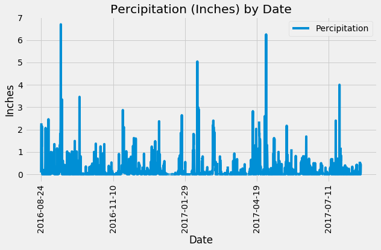
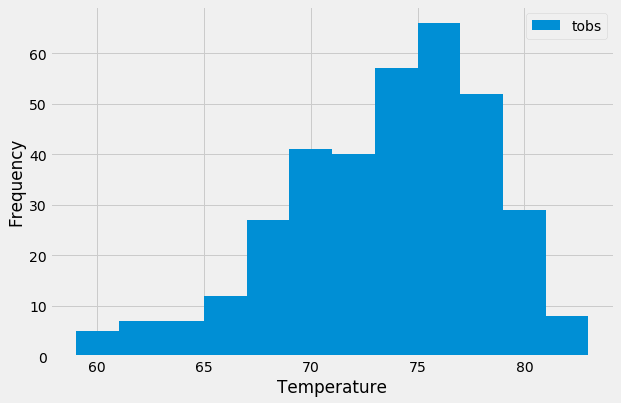
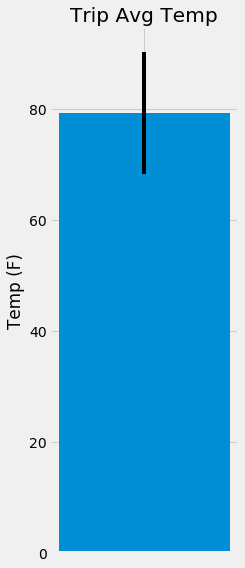
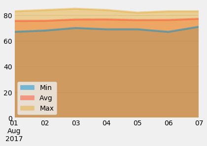

# Hawaii-Weather-Visuals

* This project uses climate data from Hawaii to look at temperature and percipitation trends in Hawaii.  

* Visulas show the percipitation in inches for the most recent year in the data set, and the temperature observations from one location in hawaii for one year. 

* A flask app displays the results of the following queries:
    * The percipation from the most recent year in the data 
    * A list of all stations where climate was observed
    * The temperature observations from the most recent year for the station with the most observations
    * The minimum, maximum, and average temperature for any date range in the date.

* An independent T-test, with a p-value close to 0, shows there is a meaningful difference between the temperatures in June and December.

* To see if visiting hawaii from Augst 1 - August 7 will be enjoyable, climate-wise, a bar graph with an error bar shows the minimum, maxuimum, and average temperature for the date range from a recent year in the data. 

* Total rainfall inches for each observation station was also calulcated for the same date range. The station in PEARL CITY, HI US had the lowest total rainfall in inches. 

* Daily normals (averge, minimum, and maximum) of temperature for the date range were calculated and graphed on an area plot.  

